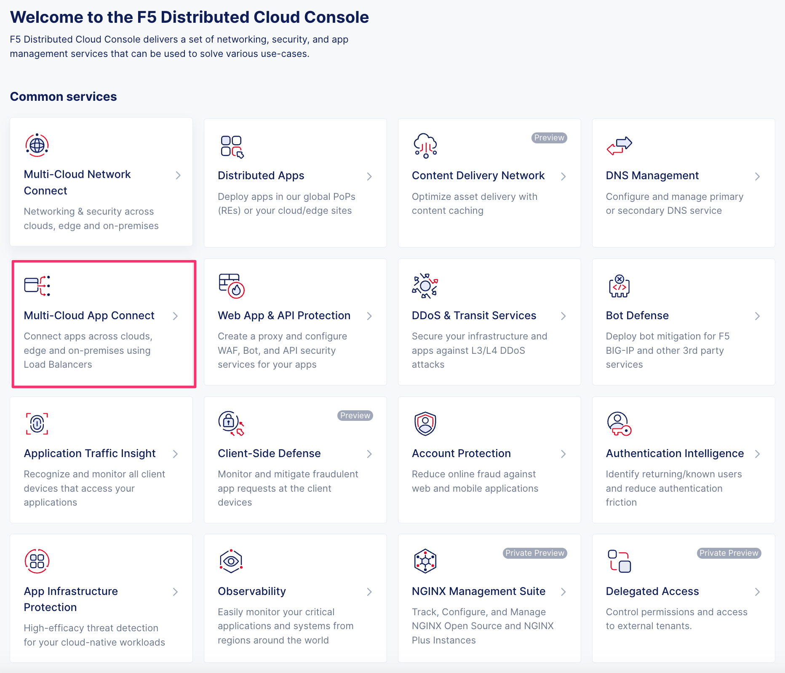

Environment Information
=======================

Login to the F5XC console and gather dynamic resource names for use within the lab

Login to the F5XC console
-------------------------

|image06|

.. note:: An email from UDF should have arrived for login to the `f5-xc-lab-mcn tenant`_.

Navigate to Multi-Cloud Network Connect
---------------------------------------

|image01|

Navigate to Site Tokens
-----------------------

|image02|

Store student-ce-site token someplace for later user
----------------------------------------------------

|image03|

Navigate to Multi-Cloud App Connect
-----------------------------------

|image04|

Store the unique namespace name someplace for later user
--------------------------------------------------------

|image05|

Module Complete
---------------

.. sectnum::

.. _`f5-xc-lab-mcn tenant`: https://f5-xc-lab-mcn.console.ves.volterra.io/

