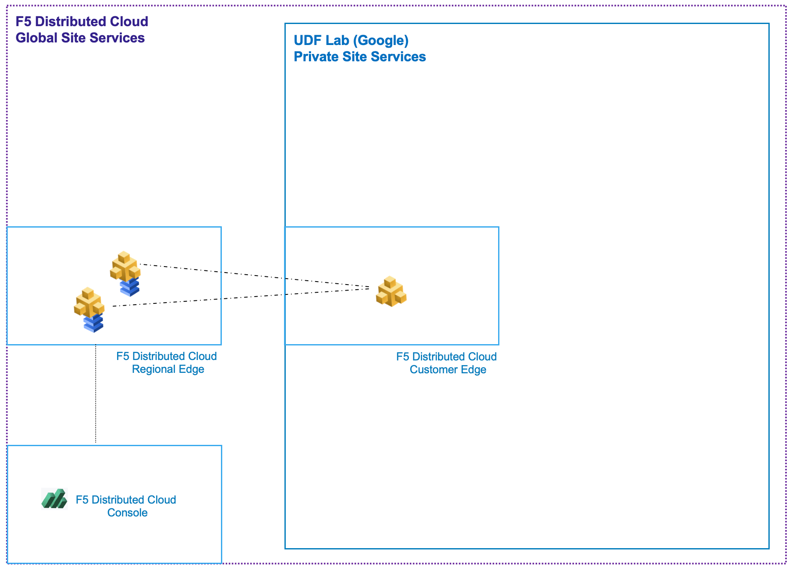

F5XC Customer Edge
==================

This module will bring an F5XC Customer Edge online. The F5XC CE is a virtual machine that will connect our private UDF environment to F5XC Application Delivery Network. Once connected, private services can be protected and exposed globally.
  
.. warning:: Estimated completion time 30 minutes

This module will add an F5 Distributed Cloud Customer Edge under control of the F5 Distributed Cloud Console:

|image13|

.. toctree::
   :maxdepth: 1
   :glob:

   step*

