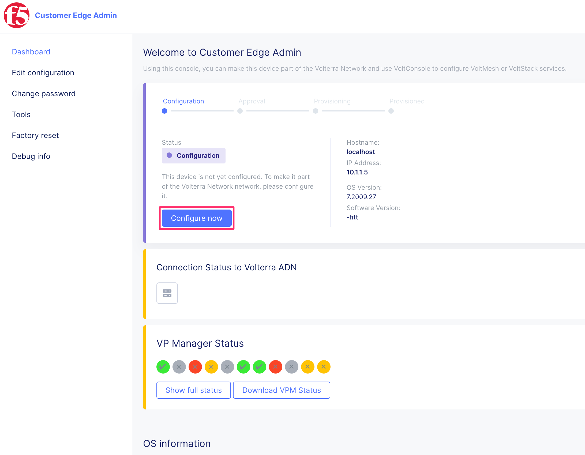

F5XC Customer Edge
==================

Bind an F5XC Customer Edge to F5XC Application Delivery Network

Login to F5XC Site UI
---------------------

From UDF navigate to the F5 Distributed Cloud CE and use the **Site UI** access method

|image01|

.. note:: F5 Distributed Cloud CE credentials are located under **details** of the instance

Start configuration
-------------------

Locate the **Configure Now** radio button

|image02|

Input configuration
-------------------

The Token, Cluster Name, and Hostname need to be filled out. The token we acquired in module01. The hostname and cluster name can be the same, we are going to use our dynamic namespace name also from module01 with an appended *-udf* to notate the cloud this cluster is running in.

Latitude and Longitude are used by the F5 Distributed Cloud CE to identify which two F5 Distributed Cloud Regional Edges are closest. Having the regional edges correctly identified will improve latency between the CEs and REs.

Attributes:

- Cluster Name: ``<unique namespace>-udf``
- Hostname: ``<unique namespace>-udf``
- Latitude: ``45.594564``
- Longitude: ``-121.178682``

|image03|
|image04|

F5XC CE Approval
----------------

Once the configuration process is complete an approval process will kick-off. When the CE has changed its status to approval we move back into the console and approve the system.

|image05|

Navigate back to the console under registrations we approve the newly created CE. 

|image06|

.. warning:: All CEs that are in a registration process will show, approve only the one you created.

Re-verify the settings for the CE, Latitude and Longitude, name, etc. Save and Exit

|image07|

F5XC CE Provisioning
--------------------

Once a site has been approved for registration it will appear under **Sites**. The process begins by bringing the CE up-to-date, peerings, and availability. 

Viewed from the console:

|image08|

Viewed from the site UI:

|image09|

.. note:: Time for upgrades and provisioning will vary, most are around 20 minutes.

F5XC CE Ready
-------------

After the site is registered and provisioned it will become available to the console as a full resource.

Viewed from the console:

|image10|

Viewed from the site UI:

|image11|

F5XC CE Status
--------------

Once the site is done all management about the site, and analytics will be done from the console. At this point, the site can expose services to site location resources, and act as an ingress or egress gateway.

|image11|

Module Complete
---------------

.. sectnum::

