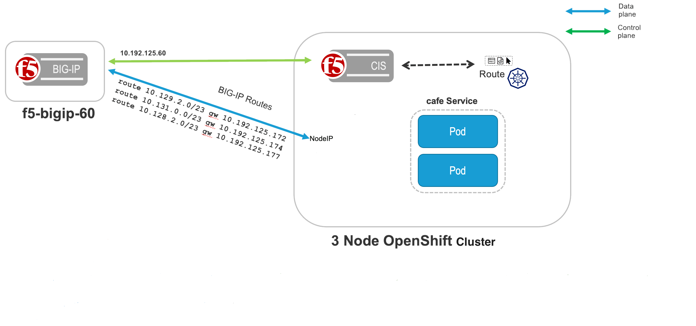
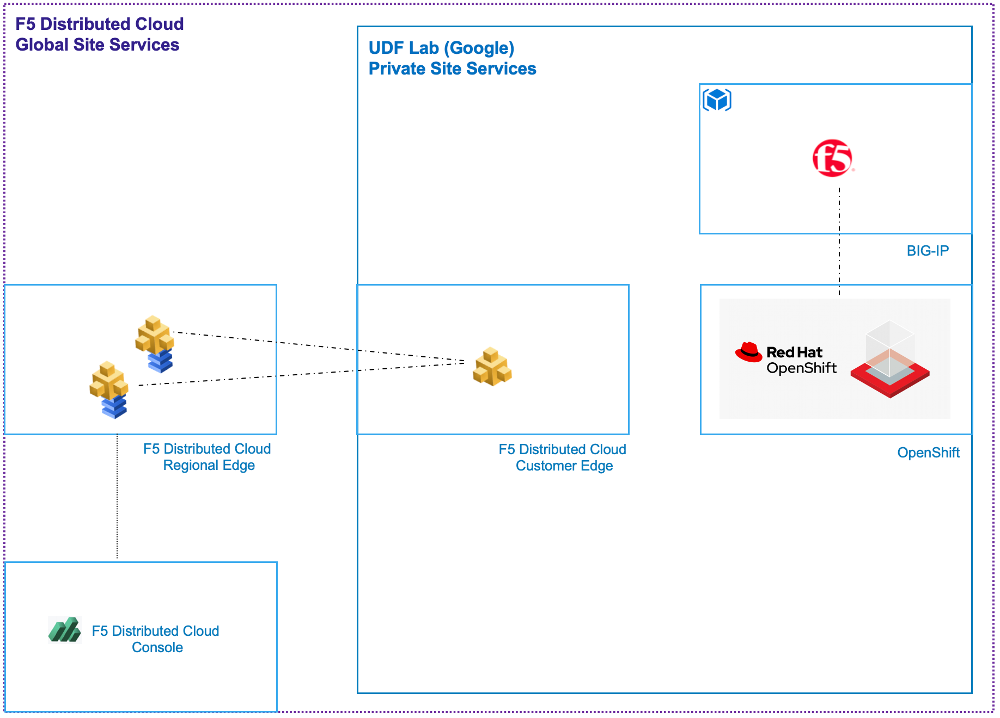

BIG-IP and OpenShift
====================

BIG-IP integration with OpenShift has been ongoing for several years. The integration has matured through many different Openshift versions and networking. In this deployment, OpenShift is 4.12 and runs the latest OVN-style networking. The advantage of the OVN networking is BIG-IP can direct traffic of services directly at the Node with the ClusterIP of the service *without* having to maintain vxlan configuration and tunnels.

This provides the best options for speed and ease of setup.

There is no special license needed for a BIG-IP to do this integration and all supported BIG-IP platforms (Virtual or Hardware) work

This module will pair together using routes and OVN, an OpenShift cluster and a BIG-IP instance. Utilizing BIG-IP Container Ingress Services (CIS) the BIG-IP will take actions against the BIG-IP from OpenShift resources (Routes). These actions will create BIG-IP objects like, Virtuals, iRules, Pools, and dynamically populate pool members of OpenShift services.

OpenShift + BIG-IP:

|image18|

This module will add a BIG-IP to an OpenShift environment:

|image19|

.. note:: BIG-IP has other integrations with Openshift which dont have OVN networking enabled.
  
.. warning:: Estimated completion time 45 minutes

.. toctree::
   :maxdepth: 1
   :glob:

   step*

