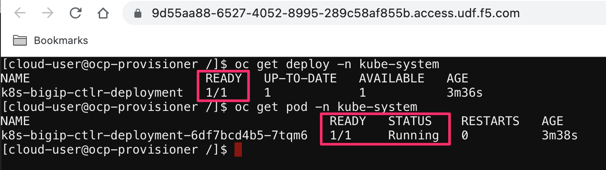

BIG-IP and OpenShift
====================

Access BIG-IP Web Shell
-----------------------

From UDF navigate to the BIG-IP and use the **WEB SHELL** access method

|image01|

Create the OpenShift Partition on BIG-IP
----------------------------------------

Partitions on BIG-IP are used as logical seperation of configuration. Since OpenShift will be the environment where resources are created we will create a BIG-IP partition for this configuration to exist.

Copy and Paste:

.. literalinclude:: files/big-ip-partition.code
   :language: bash

Example:

|image02|

.. note:: Partitions are a requirement, and are a best practise to keep changes isolated

Create BIG-IP Routes to OpenShift Nodes
---------------------------------------

OpenShift OVN networking without tunnels needs to have routes in place on the BIG-IP so it can send traffic at the OpenShift services. Our OpenShift cluster is 5 nodes (Masters scheduleable), so we create 5 routes.

An OpenShift node (or kubernetes) will be allocated a range of IP address which are assignable from the scheduler. Each of these ranges were allocated as the nodes were brought into the cluster and do not overlap. We can find the ranges assigned to a node after creatation with ``oc describe nodes`` or ``kubectl describe nodes``

Copy and Paste:

.. literalinclude:: files/big-ip-routes.code
   :language: bash

Example:

|image03|

Access ocp-provisioner Web Shell
--------------------------------

From UDF navigate to the ocp-provisioner and use the **web shell** access method

|image04|

Switch linux user to cloud-user
-------------------------------

cloud-user is preconfigured with access to OpenShift resources, moving from root to cloud-user to access OpenShift.

Copy and Paste:

.. literalinclude:: files/ocp-user.code
   :language: bash

Example:

|image05|

.. warning:: This step is required, Root user does not have a kubeconfig file to access OpenShift

Create an OpenShift namespace
-----------------------------

Similar to BIG-IP partitions, OpenShift (and kubernetes) have a logical organization object of a namespace. We will be creating resources in a single namespace, which needs to be created first.

The namespace contains an annotation for gateways, the address that is contained is this annotation is the self-ip of the BIG-IP in our lab. This tells OpenShift that traffic should be returned to this IP address, creating our traffic flow

Copy and Paste:

.. literalinclude:: files/ocp-namespace.code
   :language: bash

Example:

|image06|

Create a BIG-IP controller secret
---------------------------------

The BIG-IP controller (Container Ingress Services, Next Generation Router) needs credentials for accessing the BIG-IP to build our objects. This creates the OpenShift secret containing the credentials.

Copy and Paste:

.. literalinclude:: files/ocp-secret.code
   :language: bash

Example:

|image07|

Create a BIG-IP service account
-------------------------------

The BIG-IP controller (Container Ingress Services, Next Generation Router) needs a service account that can monitor the OpenShift resources.

Copy and Paste:

.. literalinclude:: files/ocp-serviceaccount.code
   :language: bash

Example:

|image08|

Create OpenShift cluster role and cluster role binding
------------------------------------------------------

Weve created the service account, now we need to bind some authorizations and bind the two (role and authoriaztions) together. 

Copy and Paste:

.. literalinclude:: files/ocp-clusterrole.code
   :language: bash

Example:

|image09|

BIG-IP controller custom resource definitions
---------------------------------------------

Custom resources are extensions of the Kubernetes API. BIG-IP CIS can utilize custom resource definitions to bring more BIG-IP features into the Router or Ingress configuration through the use of Virtual Servers.

To utilize these new resources we are bringing their definitions into our OpenShift cluster.

.. note:: We are not using any of these features in this lab, however are add the crds to remove unwanted missing resource logs

Copy and Paste:

.. literalinclude:: files/ocp-crds.code
   :language: bash

Example:

|image10|

BIG-IP controller global configmap
----------------------------------

The global configmap is used to create the BIG-IP virtual (vserverAddr). Since OpenShift routes are a shared VIP with routing based off layer 7 attributes BIG-IP needs to have a VIP to attach these routes with. With a recent release, you now have the ability to have mulitple BIG-IP VIPs definitions for individual namespaces, this allows for granular traffic based on a per-namespace concept.

.. note:: Global configmaps need to be deployed into the namespace its going to be applied to.

Copy and Paste:

.. literalinclude:: files/ocp-global-cm.code
   :language: bash

Example:

|image11|

BIG-IP controller deployment
----------------------------

The BIG-IP controller (Container Ingress Services, Next Generation Router) is the tool which take OpenShift events, converts them to BIG-IP configuration, and maintains the state. CIS constantly monitors the OpenShift environment for resource changes, like pods scaling, or service changes and reflects the changes in the BIG-IP.

Information about: `Configuration Parameters`_

.. note:: For partitions that are managed via CIS, no manual configuration should be done, as it will be replaced with the state known by CIS

.. note:: Best practise is a CIS controller per-BIG-IP  

Copy and Paste:

.. literalinclude:: files/ocp-cis-deployment.code
   :language: bash

Example:

|image12|
|image13|

BIG-IP controller verification
------------------------------

The BIG-IP controller deployment is a service running inside the OpenShift environment, after the deployment is complete we can verify that the service is running.

.. note:: Just like other services logs of the container can be view with the *oc log <pod> -n kube-system*

Copy and Paste:

.. literalinclude:: files/ocp-cis-verify.code
   :language: bash

Example:

|image14|

Cafe Deployment
---------------

Our Openshift needs an application to expose. The cafe application is a very simple nginx deployment that reads some host information and http information. It will allow us to see which pod we are accessing and the uri.

There will be three applications created, coffee, tea, and mocha. We will route to each of these different services with an OpenShift route the BIG-IP is hosting

Copy and Paste:

.. literalinclude:: files/ocp-cafe-deployment.code
   :language: bash

Example:

|image15|

Cafe Service
------------

Services differ from deployments as a service exposes the deployment resources to the cluster, or outside the cluster. We need to create a service so that resources inside the cluster can reach coffee, tea, and mocha. We will create our services with a ClusterIP service, this means the IP address assigned to the service, and thus the deployment will be private to the cluster. 

.. note:: OVN networking on OpenShift allows us to target the ClusterIP address, without OVN we would need a tunnel or a NodePort style service

Copy and Paste:

.. literalinclude:: files/ocp-cafe-service.code
   :language: bash

Example:

|image16|

OpenShift Routes
----------------

In the OpenShift cluster CIS ready and listening for OpenShift resources, we also created some applications and services. Up until this point there hasnt been a connection between the two parts. OpenShift routes are what bind these two entities together. CIS will look for routes, convert them to BIG-IP configuration and post it to the BIG-IP.

The routes applied only contains a few of the available options, host, port, tls, and service name.

- `Route examples`_
- `Route options`_

Copy and Paste:

.. literalinclude:: files/ocp-cafe-routes.code
   :language: bash

Example:

|image17|

Module Complete
---------------

.. sectnum::

.. _`Configuration Parameters`: https://clouddocs.f5.com/containers/latest/userguide/config-parameters.html

.. _`Route examples`: https://raw.githubusercontent.com/f5devcentral/f5-cis-docs/main/user_guides/ovn-kubernetes-standalone/next-gen-route/route/cafe/secure/route-tea-edge.yaml

.. _`Route options`: https://clouddocs.f5.com/containers/latest/userguide/routes.html

