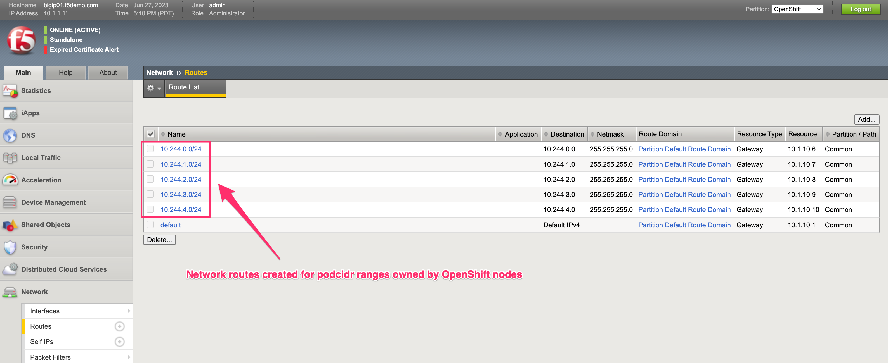

BIG-IP, OpenShift, and Application Validation
=============================================

Application Objects
-------------------

To browse our application we will utilize the **ocp-provisioner** jumphost

From UDF navigate to the ocp-provisioner and use the **XRDP** access method

|image01|

Application Access
^^^^^^^^^^^^^^^^^^

Open Firefox 

|image02|

Accept Certificate Warnings

|image03|

Browse cafe.example.com

|image04|

OpenShift Objects
-----------------

OpenShift management is installed and accessible from the ocp-provisioner bookmarks. The resources for this lab were created with commands, but the resources also exist in the management.

|image05|

BIG-IP Objects
--------------

Configuration of resources is quicker through the command line. However, its useful to still see what objects have been created in the BIG-IP TMUI. 

BIG-IP TMUI
^^^^^^^^^^^

From UDF navigate to the BIG-IP and use the **TMUI** access method

.. note:: Login credentials are located under details

Partition
^^^^^^^^^

Partition created for OpenShift

|image06|

Routes
^^^^^^

Routes created for the OpenShift nodes

|image07|

Pools
^^^^^

Pools created for the three services in OpenShift

|image08|

Pool Members
^^^^^^^^^^^^

Pool members for one of the OpenShift services

|image09|

Virtuals
^^^^^^^^

A virtual server that was created via the global configmap for the cafe namespace

|image10|

iRules and Policies
^^^^^^^^^^^^^^^^^^^

iRules and policies that were created by BIG-IP CIS, are used to attach different resources for different paths or host matches 

|image11|

TLS
^^^

TLS profiles that were created from the route manifests 

|image12|

Changing Resources
------------------

After exploring the objects that were created in the previous modules, here are a few commands we can use to show some changes.

.. code-block:: bash
  :emphasize-lines: 2,5,8,11,14

  # Scale deployment coffee, how fast are pools updated?
  oc scale --replicas=7 deployment coffee -n cafe
  
  # Scale deployment mocha, how fast are pools updated?
  oc scale --replicas=14 deployment mocha -n cafe
  
  # Scale deployment tea, how fast are pools updated?
  oc scale --replicas=21 deployment tea -n cafe
  
  # Delete route, what changes?
  oc delete route deployment cafe-coffee-edge -n cafe
  
  # Delete a service, what changes?
  oc delete service mocha-svc -n cafe

Module Complete
---------------

.. sectnum::

.. |image02| image:: images/image02.png
  :width: 75%
  :align: middle

