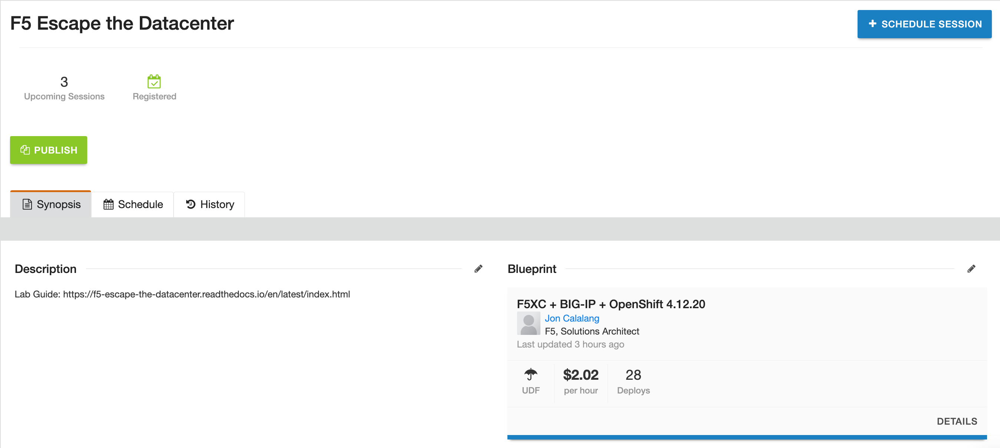

.. F5 Escape the Datacenter documentation master file, created by
   sphinx-quickstart on Wed Jun 28 07:17:33 2023.
   You can adapt this file completely to your liking, but it should at least
   contain the root `toctree` directive.

Welcome to F5 Escape the Datacenter Lab!
========================================

|image02|

Escaping from the data center requires tools and technologies at the ready. As we move between different physical, virtual, and container environments learn how the F5 products (F5 Distributed Cloud, BIG-IP) can secure, scale, and deliver your applications where you are today and tomorrow.

We will be working with RedHat OpenShift, BIG-IP, and F5 Distributed Cloud to expose services at different service tiers, Sites, and Globally. Highlighting different security practices and architectures.

This lab requires a F5 UDF blueprint, the easiest way is to utilize an F5 UDF course. Blueprint for internal use will also work.

F5 UDF Course:

|image01|

Complete Lab Components:

|image03|

Component details:

OpenShift 4.12.20
  - 3 Master nodes / 2 Worker nodes
  - About: https://www.redhat.com/en/technologies/cloud-computing/openshift

BIG-IP 17.1.0.1
  - About: https://www.f5.com/products/big-ip-services

F5 Distributed Cloud
  - KVM Customer Edge
  - About: https://www.f5.com/cloud

.. toctree::
   :maxdepth: 2
   :caption: Contents:

.. toctree::
   :maxdepth: 2
   :caption: Lab Modules

   /docs/modules/module01/index
   /docs/modules/module02/index
   /docs/modules/module03/index
   /docs/modules/module04/index
   /docs/modules/module05/index

Indices and tables
==================

* :ref:`genindex`
* :ref:`modindex`
* :ref:`search`

